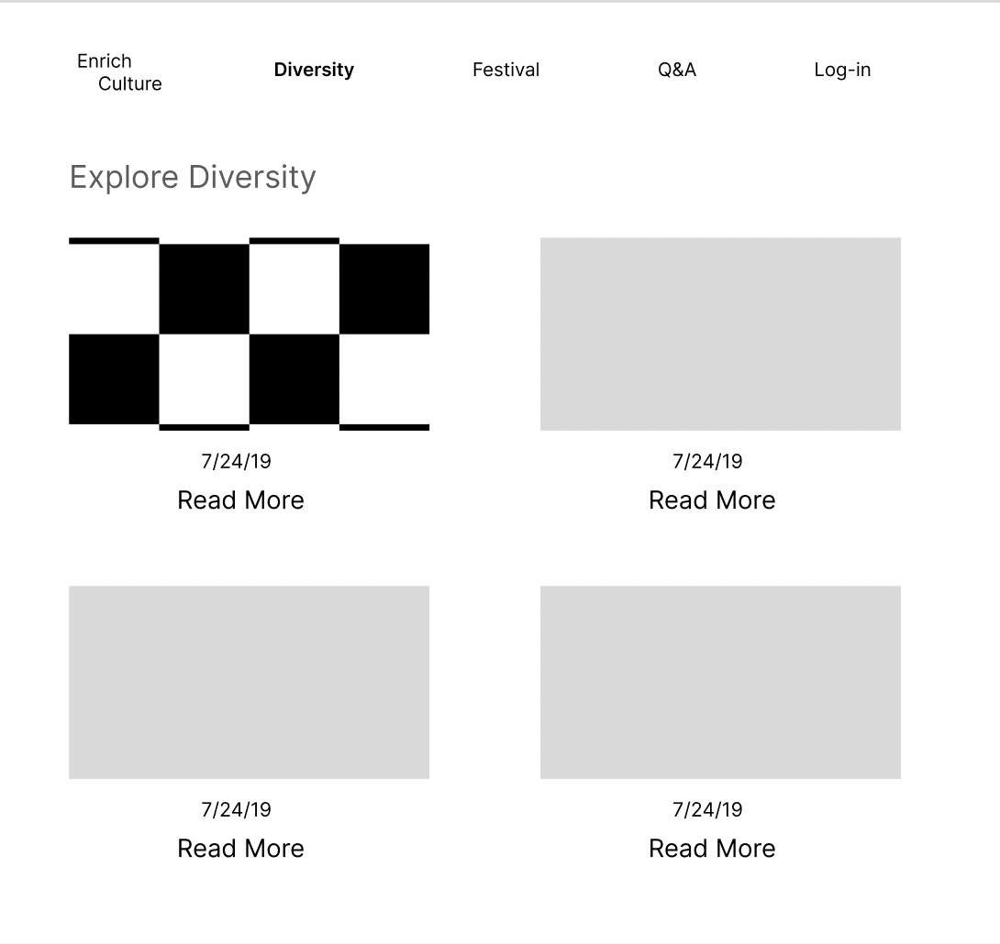

# Phase 2: Design & Specifications
###### Team:
* ExCultHub, EnrichCulture
* **Marina Cui** (Project Manager)
* **Siyuan Ji** (Developer)
* **Junjie Wei** (Developer)
* **Zonglin Zuo** (Project Designer)

### Problem Statement

 * Traditional cultures are threatened because of the rapid advancements in technology. They cause changes in how people live and spread cultural homogeneity due to globalization. It's notable that 55% of the world’s population lives in urban areas, a proportion that is expected to increase to 68% by 2050 ([Nations, n.d.](https://www.un.org/en/desa/2018-revision-world-urbanization-prospects)). Furthermore, issues such as immigration, colonialism, and the mass commercialization of culture also contribute to the marginalization of traditional culture.

 * The challenge of preserving and sustaining traditional cultures impacts diverse communities, including native communities, ethnic minorities, and even the majority populations around the globe. Additionally, younger generations struggle to connect with their cultural roots as a result of strong influences from globalization and digital media. Such vicious spirals worsen the transmission and preservation of traditional cultures.

 * With globalization and urbanization, cultures face increased homogenization, potentially losing their unique practices, languages, and knowledge systems. This issue has significant implications for cultural diversity, human rights, global heritage, and even the economy ([Inglehart & Baker, 2000](https://doi.org/10.2307/2657288)). The gradual erosion of traditional cultures threatens the social fabric, individual identity ([Lieber & Weisberg, 2002](http://www.jstor.org/stable/20020163)), and community cohesion of societies worldwide. Disappearing languages are a cause for serious concern; no less than 40% of some 6700 languages spoken nowadays are in danger of disappearing, according to the UNESCO Atlas of Languages in Danger ([Towards World Atlas of Languages | Unesco, n.d.](https://www.unesco.org/en/articles/towards-world-atlas-languages)), a testament to this growing issue. The loss of cultural heritage and traditional knowledge systems paves the way for a cultural disconnect, leaving future generations ill-equipped to appreciate their cultural roots.

* Many attempts have been made to solve the issues that traditional cultures face. The World Heritage Protection Program ([Centre, n.d.](https://whc.unesco.org/en/list/)) and the formation of cultural reserves are two examples. Nonetheless, resource limits and the intrinsic complexity of traditional civilizations make long-term sustainability difficult. Besides, there are also some existing websites of traditional cultures that people can check out, such as [The Palace Museum Digital Library](https://digicol.dpm.org.cn/); however, they are limited to one culture and a single category per website and are unable to comment or interact with them. Thus, users will find it hard to fully get to know their own cultures as well as other cultures that they are interested in, not to mention the communication and interaction within and between cultures.

### Solution

* Our website, Enrich-Culture will provide a robust solution to the problem of preserving and promoting traditional cultures in this rapidly changing world. By Developing the [Homepage] section and searching capabilities using keywords, users can dig into a rich tapestry of various cultures from all over the world. A [Diversity] page will encourage user engagement and interaction by enabling them to post about their own cultures and explore others’. By featuring the [Festival] page, a showcase of global festivals filtered by country and month, it is possible to provide a comprehensive and interactive calendar of cultural celebrations worldwide. Our platform also provides personalized user profiles, the [Log-in] page, where individuals can share their cultural posts and engage with those that interest them. Unlike existing cultural preservation websites, ours encourages active participation and fosters a sense of community. By leveraging technology's connective power, our website will help bridge the gap between tradition and modernity, empower users to engage with their cultural roots, and foster mutual understanding and respect for global cultural diversity.

### Design

* **Homepage:** This page gives some basic cultural information as well as a search bar for users to utilize; under the Explore Diversity area, users may view examples of high-quality tweets, which acts as a quick mirror of the diversity page. Users may find the material they desire by searching for keywords in the search bar section.

 

* **Sign in:** This page provides returning users with an interface to log back into their accounts. Users can input their email and password to gain access to the page. For those who don't yet have an account, they can utilize the 'Sign Up for Free' feature to establish a new one.

 

* **Sign up:** This page caters to users who do not have an account, allowing them to enter fundamental information like their last name, first name, email, and password to establish a new account. Alternatively, users have the option to access the page using their Gmail account. If users already have an account, they can utilize the 'Log In' feature to return to the sign-in page for logging in.

 

* **Diversity:** This page hosts all public posts, and users have the option to utilize a feature on the left to filter and view posts based on their preferences. Additionally, users can employ the 'Like' feature to add posts to their favorite list.

 

* **Festival:** This page mostly covers traditional events in various nations. Users may filter festivals using the left-hand filter tool (country and month). For example, the user may enter a certain nation and a specified month, and then search for any festivals that satisfy these two criteria.

 

* **Q&A:** This Page primarily assists users in answering festival-related questions. We will include an AI model to help users find solutions to their questions.

 

* **Setting:** This page allows users to update the basic information associated with their account. It doesn't require much private information, and the provision of details is mostly optional. Available fields include last name, first name, pronouns, bio, link, and notification settings. Users also have the ability to modify their profile picture using the 'Edit photo or avatar' feature. Additionally, a switch button is provided to enable or disable notifications. Once all changes have been made, users can save these by clicking on 'Done'.

 

* **User account page:** This page allows users to view their fundamental details along with their posts, likes, and trending data. It includes statistics such as the number of followers they have, posts they've made, and accounts they're following. Moreover, it has a feature that allows users to edit their profile and a nav bar to help users access other pages.

 

* **Public user account page:** This page enables users to explore the basic details and posts of other users. It provides statistics such as the number of followers, posts created, and followed accounts of the public user. Additionally, it features options allowing users to follow the public user's account or get their contact or email. The page also incorporates a navigation bar for easier access to other pages.

 

* **Error page:** This page contains a clear notice that the page the user is trying to access is unavailable. If the page has been deleted, if the user entered or clicked a broken link, or if the site's URL has changed, this page will remind the user to return to the main interface for other content inquiries.

 

### Reference

Centre, U. W. H. (n.d.). Unesco world heritage centre—World heritage list. UNESCO World Heritage Centre. Retrieved June 25, 2023, from https://whc.unesco.org/en/list/

Nations, U. (n.d.). 2018 revision of world urbanization prospects. United Nations. Retrieved June 25, 2023, from https://www.un.org/en/desa/2018-revision-world-urbanization-prospects

Towards world atlas of languages | unesco. (n.d.). Retrieved June 25, 2023, from https://www.unesco.org/en/articles/towards-world-atlas-languages

Inglehart, R., & Baker, W. E. (2000). Modernization, Cultural Change, and the Persistence of Traditional Values. American Sociological Review, 65(1), 19–51. https://doi.org/10.2307/2657288

Lieber, R. J., & Weisberg, R. E. (2002). Globalization, Culture, and Identities in Crisis. International Journal of Politics, Culture, and Society, 16(2), 273–296. http://www.jstor.org/stable/20020163

故宫博物院数字文物库 (The Palace museum digital library). Official Website. Retrieved from https://digicol.dpm.org.cn/
